# Traffic Sign Recognition 

## Writeup Template


---

**Build a Traffic Sign Recognition Project**

The goals / steps of this project are the following:
* Load the data set 
* Explore, summarize and visualize the data set
* Design, train and test a model architecture
* Use the model to make predictions on new images
* Analyze the softmax probabilities of the new images
* Summarize the results with a written report


[//]: # (Image References)

[image1]: ./examples/visualization.jpg "Visualization"
[image2]: ./examples/grayscale.jpg "Grayscaling"
[image3]: ./examples/random_noise.jpg "Random Noise"
[image4]: ./examples/placeholder.png "Traffic Sign 1"
[image5]: ./examples/placeholder.png "Traffic Sign 2"
[image6]: ./examples/placeholder.png "Traffic Sign 3"
[image7]: ./examples/placeholder.png "Traffic Sign 4"
[image8]: ./examples/placeholder.png "Traffic Sign 5"

## Introduction


You're reading it! and here is a link to my [project code](https://github.com/udacity/CarND-Traffic-Sign-Classifier-Project/blob/master/Traffic_Sign_Classifier.ipynb)

## Data Set Summary & Exploration

### 1. Basic summary of the data set 

The code for this step is contained in the second code cell of the IPython notebook.  

I used the pandas library to calculate summary statistics of the traffic
signs data set:

* The size of original training set is 34799
* The size of the validation set is 4410 
* The size of test set is 12630
* The shape of a traffic sign image is 32x32x3 represented as integer values (0-255) in the RGB color space
* The number of unique classes/labels in the data set is 43


### 2. Exploratory visualization of the dataset

Here is an exploratory visualization of the data set. It is a bar chart showing how many sample we have for each classes.

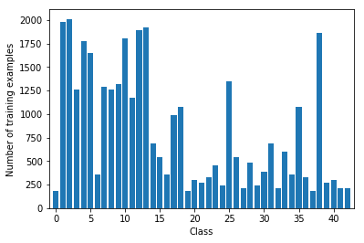

We can notice that the distribution is not balanced. We have some classes with less then 300 examples and other well rapresented with more then . We can analize now the validation dataset distribution:

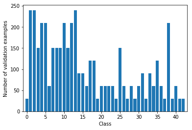

The distribution is very similar. In general, it would be a good idea to balance the dataset, but in this case I am not sure it would be very useful, since in reality some kind of traffic signs (for example ) could occour less frequently then others (the stop sign for example). 

```
Class 0: Speed limit (20km/h)                                180 samples
Class 1: Speed limit (30km/h)                                1980 samples
Class 2: Speed limit (50km/h)                                2010 samples
Class 3: Speed limit (60km/h)                                1260 samples
Class 4: Speed limit (70km/h)                                1770 samples
Class 5: Speed limit (80km/h)                                1650 samples
Class 6: End of speed limit (80km/h)                         360 samples
Class 7: Speed limit (100km/h)                               1290 samples
Class 8: Speed limit (120km/h)                               1260 samples
Class 9: No passing                                          1320 samples
Class 10: No passing for vehicles over 3.5 metric tons        1800 samples
Class 11: Right-of-way at the next intersection               1170 samples
Class 12: Priority road                                       1890 samples
Class 13: Yield                                               1920 samples
Class 14: Stop                                                690 samples
Class 15: No vehicles                                         540 samples
Class 16: Vehicles over 3.5 metric tons prohibited            360 samples
Class 17: No entry                                            990 samples
Class 18: General caution                                     1080 samples
Class 19: Dangerous curve to the left                         180 samples
Class 20: Dangerous curve to the right                        300 samples
Class 21: Double curve                                        270 samples
Class 22: Bumpy road                                          330 samples
Class 23: Slippery road                                       450 samples
Class 24: Road narrows on the right                           240 samples
Class 25: Road work                                           1350 samples
Class 26: Traffic signals                                     540 samples
Class 27: Pedestrians                                         210 samples
Class 28: Children crossing                                   480 samples
Class 29: Bicycles crossing                                   240 samples
Class 30: Beware of ice/snow                                  390 samples
Class 31: Wild animals crossing                               690 samples
Class 32: End of all speed and passing limits                 210 samples
Class 33: Turn right ahead                                    599 samples
Class 34: Turn left ahead                                     360 samples
Class 35: Ahead only                                          1080 samples
Class 36: Go straight or right                                330 samples
Class 37: Go straight or left                                 180 samples
Class 38: Keep right                                          1860 samples
Class 39: Keep left                                           270 samples
Class 40: Roundabout mandatory                                300 samples
Class 41: End of no passing                                   210 samples
Class 42: End of no passing by vehicles over 3.5 metric tons  210 samples

```

## Design and Test a Model Architecture

### 1. Pre-processing 

Here the function I use to pre-process each image in the dataset:

```python
def pre_processing_single_img (img):

    img_y = cv2.cvtColor(img, (cv2.COLOR_BGR2YUV))[:,:,0]
    img_y = (img_y / 255.).astype(np.float32)
    img_y = (exposure.equalize_adapthist(img_y,) - 0.5)
    img_y = img_y.reshape(img_y.shape + (1,))

    return img_y

```

Steps:

* Convert the image to YUV and extract Y Channel that correspond to the grayscale image:  
`img_y = cv2.cvtColor(img, (cv2.COLOR_BGR2YUV))[:,:,0]`

* Normalize the image to have a range from 0 to 1:   
` img_y = (img_y / 255.).astype(np.float32) `

* Contrast Limited Adaptive Histogram Equalization (see [here](http://scikit-image.org/docs/dev/api/skimage.exposure.html#skimage.exposure.equalize_adapthist) for more information) and translate the result to have mean zero:   
`img_y = (exposure.equalize_adapthist(img_y,) - 0.5)`

* Finally reshape the image from (32x32) to (32x32x1), the format required by tensorflow:   
`img_y = img_y.reshape(img_y.shape + (1,))`   

Here is an example of a traffic sign image before and after the processing:


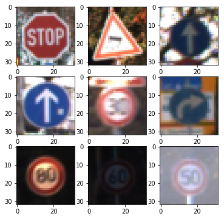 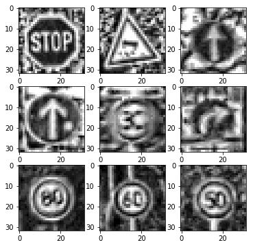


Initially I used `.exposure.adjust_log`, that it is quite fast but finally I decided to use `exposure.equalize_adapthist`, that gives a better accuracy.

### 2. Augmentation

To add more data to the the data set, I created two new datasets starting from the original training dataset, composed by 34799. In this way I obtain 34799x3 = 104397 samples in the training dataset.

### Keras ImageDataGenerator
I used the Keras function [ImageDataGenerator](https://keras.io/preprocessing/image/) to generate new images with the following settings:

```python

datagen = ImageDataGenerator(
        rotation_range=17,
        width_shift_range=0.1,
        height_shift_range=0.1,
        shear_range=0.3,
        zoom_range=0.15,
        horizontal_flip=False,
        dim_ordering='tf',
        fill_mode='nearest')

 # configure batch size and retrieve one batch of images

for X_batch, y_batch in datagen.flow(X_train, y_train, batch_size=X_train.shape[0], shuffle=False):
    print(X_batch.shape)
    X_train_aug = X_batch.astype('uint8')
    y_train_aug = y_batch
    break
```
To each picture in the training dataset is applied a rotation, a translation, a zoom and a shear transformation.   

Here is an example of an original image and an augmented image:

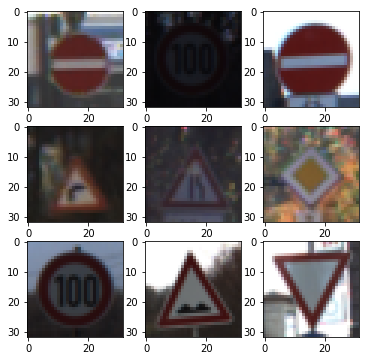 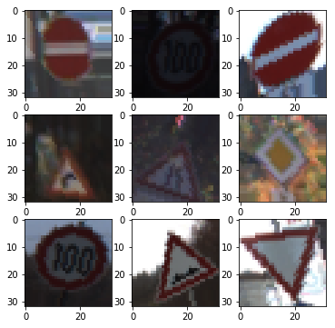

### Motion Blur
Motion blur is the apparent streaking of rapidly moving objects in a still image. 

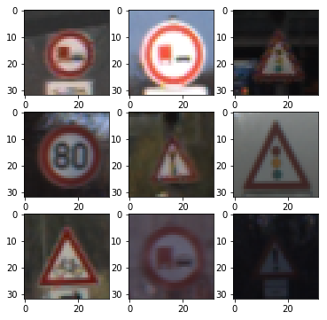 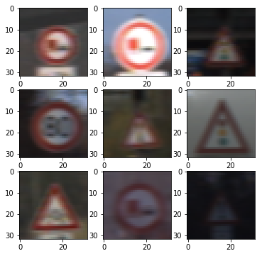


### 3. Final model architecture

I started from the LeNet network and I modified it using the multi-scale features took inspiration from the model presented in [Pierre Sermanet and Yann LeCun](http://yann.lecun.com/exdb/publis/pdf/sermanet-ijcnn-11.pdf) paper. Finally I increased the number of filters used in the first two convolutions.
We have in total 3 layers: 2 convolutional layers for feature extraction and one fully connected layer used .

| Layer         		    |     Description	        			     		| 
|:---------------------:|:---------------------------------------------:| 
| Input         		    | 32x32x1 Grayscale image   							| 
| Convolution 3x3     	| 1x1 stride, same padding, outputs 28x28x12 	|
| RELU					|												|
| Max pooling	      	| 2x2 stride,  outputs 14x14x12 				    |
| Dropout (a)         	| 0.7      									    |
| Convolution 3x3	    | 1x1 stride, same padding, outputs 10x10x24  	|
| RELU					|												|
| Max pooling	      	| 2x2 stride, output = 5x5x24.   			    |
| Dropout  (b)       	| 0.6      									    |
| Fully connected		| max_pool(a) + (b) flattend. input = 1188. Output = 320	|
| Fully connected		| Input = 320. Output = n_classes	           |
| Softmax				|         									  |


### 4. Describe how, and identify where in your code, you trained your model.

The code for training the model is located in the eigth cell of the ipython notebook. 

To train the model I used 20 epochs with a batch size of 128, the [AdamOptimizer](https://www.tensorflow.org/api_docs/python/tf/train/AdamOptimizer)(see paper [here](https://arxiv.org/pdf/1412.6980v8.pdf)) with a learning rate of 0.001.


### 5. Describe the approach taken for finding a solution. Include in the discussion the results on the training, validation and test sets and where in the code these were calculated. Your approach may have been an iterative process, in which case, outline the steps you took to get to the final solution and why you chose those steps. Perhaps your solution involved an already well known implementation or architecture. In this case, discuss why you think the architecture is suitable for the current problem.

The code for calculating the accuracy of the model is located in the ninth cell of the Ipython notebook.

My final model results were:
* training set accuracy of 0.999
* validation set accuracy of  0.985 
* test set accuracy of 0.967


If an iterative approach was chosen:
* What was the first architecture that was tried and why was it chosen?
* What were some problems with the initial architecture?
* How was the architecture adjusted and why was it adjusted? Typical adjustments could include choosing a different model architecture, adding or taking away layers (pooling, dropout, convolution, etc), using an activation function or changing the activation function. One common justification for adjusting an architecture would be due to over fitting or under fitting. A high accuracy on the training set but low accuracy on the validation set indicates over fitting; a low accuracy on both sets indicates under fitting.
* Which parameters were tuned? How were they adjusted and why?
* What are some of the important design choices and why were they chosen? For example, why might a convolution layer work well with this problem? How might a dropout layer help with creating a successful model?

If a well known architecture was chosen:
* What architecture was chosen?
* Why did you believe it would be relevant to the traffic sign application?
* How does the final model's accuracy on the training, validation and test set provide evidence that the model is working well?

#### First attempt: validation accuracy 91.5 % 
Initially I started with the LeNet architecture and with the following preprocess pipeline:
* Convert in YUV, keep the Y
* Adjust the exposure
* Normalization
Parameters:
* EPOCHS = 10
* BATCH_SIZE = 128
* Learning rate = 0.001
 
Number of training examples = 34799
Number of validation examples = 4410
Number of testing examples = 12630


#### Second attempt: validation accuracy 93.1%
I added Dropout after each layer: 
1) 0.9
2) 0.7
3) 0.6
4) 0.5


#### Third attempt: validation accuracy 93.3%
I changed network using multi-scale features as suggested in the paper [Traffic Sign Recognition with Multi-Scale Convolutional Networks](https://www.google.fr/url?sa=t&rct=j&q=&esrc=s&source=web&cd=1&cad=rja&uact=8&ved=0ahUKEwi079aWzOjSAhWHJ8AKHUx_ARkQFggdMAA&url=http%3A%2F%2Fyann.lecun.org%2Fexdb%2Fpublis%2Fpsgz%2Fsermanet-ijcnn-11.ps.gz&usg=AFQjCNGTHlNOHKmIxaKYw3_h-VYrsgpCag&sig2=llvR7_9QizK3hkAgkmUKTw)

 

#### Fourth attempt: validation accuracy 94.6%
I augmented the training set using the Keras function [ImageDataGenerator](https://keras.io/preprocessing/image/).In this way I double the training set.
 
Number of training examples = 34799x2 = 69598
Number of validation examples = 4410


#### Fourth attempt: validation accuracy 96.1%
Since the training accuracy was not very high, I decided to increase the number of filters in the first two convolutional layers.
First layer: from 6 to 12 filters.
Second layer: from 16 to 24 filters.

#### Final attempt: validation accuracy 98.5%
I augmented the data adding the motion blur to each sample of the training data. In this way I triplicate the number of samples in the training set. 
In addition I added the L2 regularization and I used the function `equalize_adapthist` instead of `.exposure.adjust_log` during the image preprocessing.

Finally I evaluated the performance of my model with the test set. The accuracy was equal to 96.7%.


## Test a Model on New Images

Here are five traffic signs from picture I took in France:   
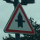    
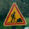     
   
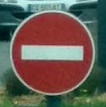   
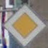   

The code for making predictions on my final model is located in the tenth cell of the Ipython notebook.

Here are the results of the prediction:

* the first image is the test image
* the second one is the prediction(an image )
* plot showing the top five soft max probabilities

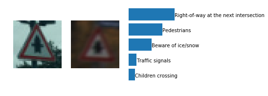 
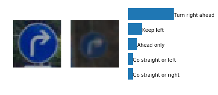 
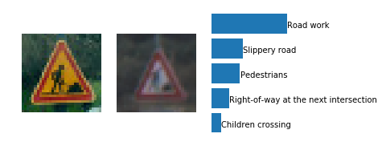 
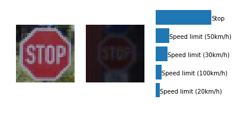 
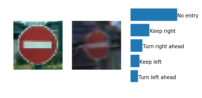 


The model was able to correctly guess 5 of the 5 traffic signs, which gives an accuracy of 100%. Nice!


<div>
    <a href="https://plot.ly/~jokla/1/?share_key=DmJjGBAv9EQXNjMc5jDWCT" target="_blank" title="Plot 1" style="display: block; text-align: center;"></a>
    <script data-plotly="jokla:1" sharekey-plotly="DmJjGBAv9EQXNjMc5jDWCT" src="https://plot.ly/embed.js" async></script>
</div>


